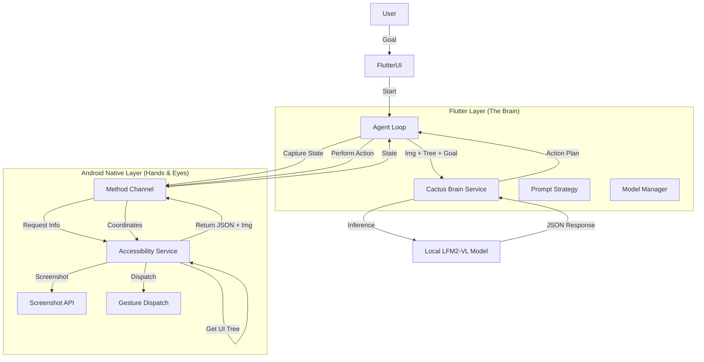

# System Architecture

Auch utilizes a hybrid architecture combining **Flutter** for the Agent "Brain" and **Kotlin (Android Native)** for the "Hands and Eyes".

## High-Level Overview

## Core Components

### 1. Perception (Android Native)
Located in `android/app/src/main/kotlin/.../MobileAgentService.kt`.

*   **Role:** Acts as the sensory organ of the agent.
*   **Mechanism:**
    *   **Screenshot:** Uses `takeScreenshot` (Android 11/API 30+) to capture the current screen content to a temporary file.
    *   **UI Tree:** Traverses the `AccessibilityNodeInfo` hierarchy.
    *   **Simplification:** Filters the tree to include only interactive nodes (Clickable, Editable) to reduce token usage for the LLM. Returns a lightweight JSON structure.

### 2. The Brain (Flutter)
Located in `lib/services/cactus_brain.dart` and `lib/agent/`.

*   **Role:** The cognitive center.
*   **Mechanism:**
    *   **Cactus VLM:** Wraps the `cactus` package to interface with the `LFM2-VL-1.6B` GGUF model.
    *   **Prompt Engineering:** Uses a rigid System Prompt (`PromptStrategy.dart`) to enforce a structured thought process (`Analysis` -> `Plan` -> `Action`) and strictly formatted JSON output.
    *   **Model Management:** `ModelManager.dart` handles locating the model file and copying it from assets if necessary.

### 3. Actuation (Android Native)
Located in `MobileAgentService.kt`.

*   **Role:** Executes physical interactions.
*   **Mechanism:**
    *   Receives (x, y) coordinates from the Flutter layer.
    *   Uses `dispatchGesture` to simulate tap events on the screen.

### 4. The Bridge
Located in `MainActivity.kt` and `lib/main.dart`.

*   **Mechanism:** A standard Flutter `MethodChannel` (`com.minitap.device/agent`) is used for bidirectional communication.
    *   `captureState`: Flutter -> Native (Request State) -> Flutter (Image Path, UI Tree JSON).
    *   `performAction`: Flutter (Coords) -> Native (Tap).

## Data Flow

1.  **Input:** User types a goal in the Flutter UI.
2.  **Loop Start:**
3.  **Capture:** Flutter calls `captureState`. Native service screenshots the device and parses the view hierarchy.
4.  **Think:** Flutter sends the Goal + Screenshot Path + UI Tree JSON to the Cactus VLM.
5.  **Plan:** The VLM returns a JSON response containing an analysis, a plan, and a target `element_id`.
6.  **Act:** Flutter resolves `element_id` to (x, y) coordinates using the previously captured UI tree and calls `performAction`.
7.  **Wait:** The agent pauses for UI transitions before the next loop iteration.
